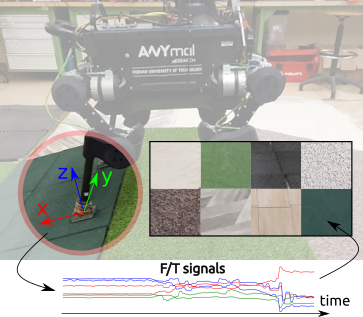

# HAPTR

[](https://drive.google.com/file/d/1QP-a1Y78LaKVN_mLt91b_10T_5YDyVD_/view?usp=sharing)


Classification of terrain type using F/T signals of ANYmal's feet using Transformer architecture.

 

## Model

 

## Citation BibTeX
```bibtex
@article{BEDNAREK2022104236,
  title = {HAPTR2: Improved Haptic Transformer for legged robots’ terrain classification},
  journal = {Robotics and Autonomous Systems},
  volume = {158},
  pages = {104236},
  year = {2022},
  issn = {0921-8890},
  doi = {https://doi.org/10.1016/j.robot.2022.104236},
  url = {https://www.sciencedirect.com/science/article/pii/S0921889022001373},
  author = {Michał Bednarek and Michał R. Nowicki and Krzysztof Walas},
  keywords = {Legged robots, Deep learning methods, Data sets for robot learning}
}
```

## License
[MIT](https://choosealicense.com/licenses/mit/)
